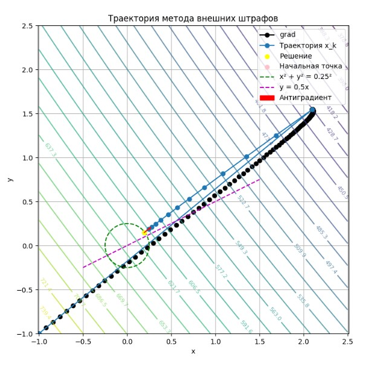
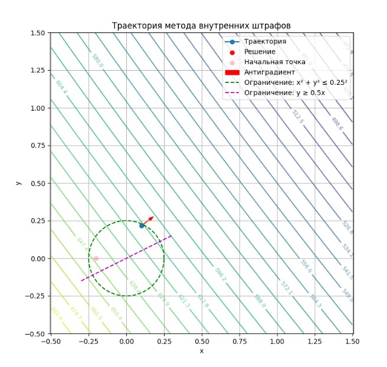
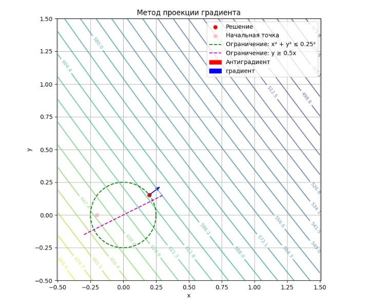

<h1>Здесь представлена моя реализация методов условной оптимизации</h1>

В этом репозитории 3 метода:
<ul>
<li>Метод внешних штрафов</li>
<li>Метод внутренних штрафов</li>
<li>Метод скольжения по границе (Метод условного градиента)</li>
</ul>

Каждый из этих методов создан так, чтобы свести задачу условной
оптимизации к безусловной. 

Например, **метод внешних штрафов** вводит штрафное слагаемое 
к целевой функции, которое штрафует ее за выход за границы 
допустимой области. Начальная точка может быть выбрана вне 
зависимости от ее принадлежности к допустимой области.
 

Ниже вы можете видеть график, показывающий работу алгоритма на 
ограничениях в виде внутренности круга и полуплоскости выше прямой.
Целевая функция: 2x^2-68x+632+2xy-52y+2y^2. Имеет минимум в точке
(14,6) равный 0. Вывод программы: Получена точка: [0.19200031 0.14635032], со значением функции: 611.5065258519468 

Черные точки показывают итерации градиентного спуска на первой
итерации основного алгоритма. Цветные линии - линии уровня целевой 
функции. 

 

Перейдем к **методу внутренних штрафов**. Этот метод также
подразумевает добавление штрафного слагаемого к целевой фукнции. 
Только подбирается оно так, чтобы при приближении к границе 
допустимой области это слагаемое устремлялось в бесконечность,
не позволяя выйти за границы. Поэтому начальная точка должна 
выбираться обязательно внутри области.
 
Сам алгоритм сошелся довольно быстро, поэтому траектории не особо
видно. Вывод программы:  
Приближённое решение: [0.09928255 0.21598145]
Найденный минимум функции:  614.1736478667873 
График представлен ниже.

 

Теперь поясним реализацию **метода скользящего градиента**. Начальная
точка выбирается внутри области. Движение происходит при помощи 
градиентного спуска - но только пока мы внутри допустимой области.
Затем, когда есть вероятность выйти за границу области, 
вектор антиградиента начинает проецироваться на границу области, 
указывая теперь направление скольжения по границе в сторону 
уменьшения значения функции. Шаг рассчитывается также с целью не 
выйти за границу. Как только шаг становится меньше 1е-4, алгоритм
останавливается.  
Вывод программы: 
Полученная точка: [0.19802026 0.15260415]
Значение целевой функции: 610.7846438572443 

Ниже приведен график работы.

 

Каждый из методов был реализован с выводом градиента, штрафного
множителя и других важных параметров по требованию преподавателя.

Если у вас есть какие-нибудь предложения по реализации этих методов
или комментарии - буду рада их увидеть! Также не стесняйтесь оценивать
этот репозиторий звездочкой, если он был вам полезен!

